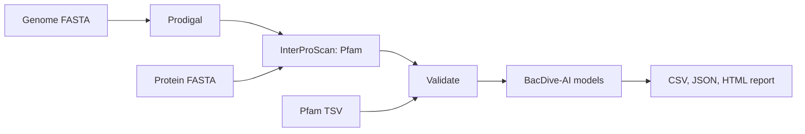

# BacDive-AI workflow

[](https://github.com/mobashirrahman/bacdive-ai-workflow/actions/workflows/ci.yml)
[](LICENSE)

A reproducible Snakemake workflow that predicts eight bacterial traits from a
genome, a protein FASTA, or an existing Pfam annotation, using the published
[BacDive-AI](https://doi.org/10.1038/s42003-025-08313-3) models. It adds the
engineering around those models. It validates inputs, integrates Prodigal and
InterProScan, records provenance, runs batches, joins reference metadata and
writes an HTML report.

**Traits:** acidophily, Gram positivity, spore formation, aerobic, anaerobic,
thermophily, psychrophily, flagellated motility.



## Quick start

Python 3.12; about 750 MB for the extracted models. The example needs no
Prodigal or InterProScan because the Pfam annotation is included.

```bash
git clone https://github.com/mobashirrahman/bacdive-ai-workflow.git
cd bacdive-ai-workflow
python3.12 -m venv .venv && source .venv/bin/activate
python -m pip install -e '.[dev,workflow]'
python -m bacdive_workflow.models --archive Archiv.zip --model-dir models
snakemake --cores 2
```

This writes `results/predictions/*.json`, `results/bacdive_ai_predictions.csv`,
`results/summary.json` and an offline `results/report.html`. Running your own
data, the batch commands and the CLI are covered in [docs/USAGE.md](docs/USAGE.md).

## Case study

The repo reconstructs an existing 120-genome run: 960 predictions (120 genomes
× 8 traits) reproduced from the models with no class changes, and 79 reference
metadata records joined. Agreement with the supplied labels is descriptive,
not a benchmark; read [RESULTS](docs/RESULTS.md) with
[PROVENANCE](docs/PROVENANCE.md) before citing any figure.
See also the [report](docs/results/report.html) and [VALIDATION](docs/VALIDATION.md).

```bash
python scripts/reproduce_case_study.py --check
```

## Limits

A prediction is an estimate from a protein-family inventory, not a measured
phenotype, and its probability is not accuracy. No models are trained here.
Results depend on assembly quality and on the InterProScan/Pfam release used.

## Credit and license

Models and the example annotation come from BacDive-AI v2 by Julia Koblitz
and Lorenz Christian Reimer ([Zenodo](https://doi.org/10.5281/zenodo.15075932)).
`Archiv.zip` is the v1.1 archive kept for offline CI and quick start; its eight
model files are byte-identical to v2. `python -m bacdive_workflow.models --download`
fetches `v2.zip`, the pinned release.
The workflow is by Md Mobashir Rahman. When using the method, cite Koblitz,
Reimer, Pukall & Overmann (2025), *Communications Biology* 8, 897,
[doi:10.1038/s42003-025-08313-3](https://doi.org/10.1038/s42003-025-08313-3).
GPL-3.0-or-later; see [LICENSE](LICENSE), [CITATION.cff](CITATION.cff),
[CONTRIBUTING](CONTRIBUTING.md) and the [changelog](CHANGELOG.md).
