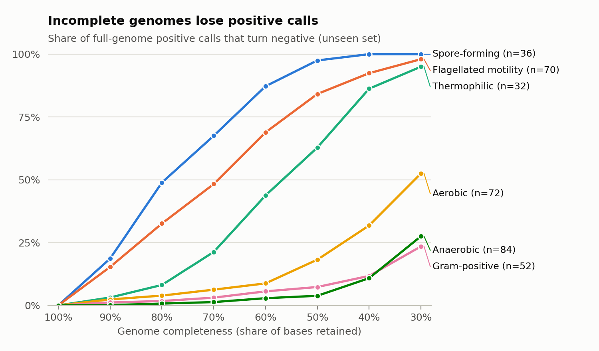
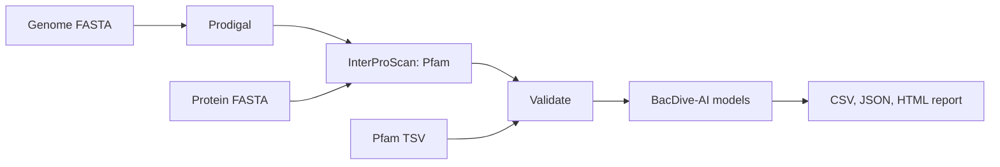

# BacDive-AI workflow

[](https://github.com/mobashirrahman/bacdive-ai-workflow/actions/workflows/ci.yml)
[](LICENSE)


A reproducible Snakemake workflow that predicts eight bacterial traits from a
genome, and an independent benchmark of how far those predictions can be
trusted.

The models are the published [BacDive-AI](https://doi.org/10.1038/s42003-025-08313-3)
random forests. This repository adds what they were missing: a validated,
provenance-tracked pipeline around them, and a test of the three situations
their original evaluation did not cover: species they never saw, incomplete
genomes, and a newer annotation release.

**Traits:** acidophily, Gram positivity, spore formation, aerobic, anaerobic,
thermophily, psychrophily, flagellated motility.

## What the benchmark found

324 genomes, selected and frozen in the repository: 150 from the models'
training set and 174 whose strain, genome and species are all absent from it.



| Question | Result |
| --- | --- |
| Do the models work on unseen species? | Yes. Balanced accuracy is 0.93 to 0.99 on six traits, the same as on training genomes. |
| Do they work on incomplete genomes? | Only partly. At 50% completeness, 97% of spore-forming, 84% of motile and 63% of thermophile calls turn negative. Negatives almost never turn positive. |
| Does the Pfam release matter? | Yes. The training-era InterProScan reproduces the authors' features (2 of 150 genomes change a prediction); a current release changes a prediction in 15 of 150. |
| Does the gene caller matter? | No. Prodigal modes and NCBI PGAP proteins agree on about 99% of calls or more for every trait. |

In practice: a positive call on an incomplete genome is reliable, a negative
call for spore formation, motility or thermophily is not, and the models
should be run with the Pfam release they were trained on.

These results come from simulated fragment loss on isolate genomes, checked
against real re-annotation (318 of 320 calls agree). Real metagenome-assembled
genomes were not tested, acidophily and psychrophily could not be assessed, and
generalisation to unseen genera is not established. The full method, tables
and limitations are in [docs/BENCHMARK.md](docs/BENCHMARK.md).

## How it works



Two workflows share one tested Python package:

| | Prediction workflow (`Snakefile`) | Benchmark workflow (`benchmark/`) |
| --- | --- | --- |
| Purpose | Predict traits for your genomes | Measure accuracy and robustness |
| Input | Genome, protein FASTA or Pfam TSV | Frozen list of 324 NCBI accessions |
| Output | Per-sample JSON, CSV, HTML report | Tables, figures, [write-up](docs/BENCHMARK.md) |
| Scale run | 120-genome case study | 1,365 jobs, about 15 hours on 16 cores |

## Quick start

Python 3.12 and about 750 MB for the extracted models. The example needs no
Prodigal or InterProScan because the Pfam annotation is included.

```bash
git clone https://github.com/mobashirrahman/bacdive-ai-workflow.git
cd bacdive-ai-workflow
python3.12 -m venv .venv && source .venv/bin/activate
python -m pip install -e '.[dev,workflow]'
python -m bacdive_workflow.models --archive Archiv.zip --model-dir models
snakemake --cores 2
```

This writes `results/predictions/*.json`, `results/bacdive_ai_predictions.csv`,
`results/summary.json` and an offline `results/report.html`. Running your own
data, the batch commands, the CLI and the benchmark are covered in
[docs/USAGE.md](docs/USAGE.md).

## Reproducibility

- **Pinned models.** Every model file is verified by SHA-256 against the
  Zenodo release before use.
- **Leakage control from data.** The benchmark excludes training strains using
  the authors' published training list, and a test enforces that no held-out
  genome shares a strain, accession or species with it.
- **Frozen inputs.** Genome selection and the label mapping are committed, so
  a rerun does not depend on the state of external databases.
- **Seeded and deterministic.** Every random draw derives from one configured
  seed; tables and figures are byte-identical across reruns.
- **No hand-typed numbers.** Tables in the write-up are generated from result
  files, and CI fails if they are stale.
- **Logs and benchmarks for every rule**, pinned conda environments, schema
  validation of config and sample sheets, and an offline test fixture that
  runs the benchmark workflow in CI.

## Repository layout

```
Snakefile, config/, envs/      prediction workflow
benchmark/                     benchmark workflow: rules, envs, schemas, frozen selection
bacdive_workflow/              Python package: prediction, validation, reporting
bacdive_workflow/bench/        benchmark logic: selection, labels, fragments, metrics, figures
tests/                         unit and regression tests
docs/                          usage, benchmark write-up, case study, validation, provenance
examples/                      runnable example and the 120-genome case study
```

## Case study

The repository also reconstructs an earlier 120-genome run: 960 predictions
reproduced from the models with no class changes. Agreement with the supplied
labels there is descriptive, not a benchmark; see [RESULTS](docs/RESULTS.md),
[PROVENANCE](docs/PROVENANCE.md) and [VALIDATION](docs/VALIDATION.md).

```bash
python scripts/reproduce_case_study.py --check
```

## Limits

A prediction is an estimate from a protein-family inventory, not a measured
phenotype, and its probability is not accuracy. No models are trained here.
Results depend on assembly quality and on the InterProScan and Pfam release
used, as the benchmark shows.

## Credit and license

Models and the example annotation come from BacDive-AI v2 by Julia Koblitz
and Lorenz Christian Reimer ([Zenodo](https://doi.org/10.5281/zenodo.15075932)).
`Archiv.zip` is the v1.1 archive kept for offline CI and quick start; its eight
model files are byte-identical to v2. `python -m bacdive_workflow.models --download`
fetches `v2.zip`, the pinned release.

The workflow and benchmark are by Md Mobashir Rahman. When using the method,
cite Koblitz, Reimer, Pukall & Overmann (2025), *Communications Biology* 8, 897,
[doi:10.1038/s42003-025-08313-3](https://doi.org/10.1038/s42003-025-08313-3).
GPL-3.0-or-later; see [LICENSE](LICENSE), [CITATION.cff](CITATION.cff),
[CONTRIBUTING](CONTRIBUTING.md) and the [changelog](CHANGELOG.md).
