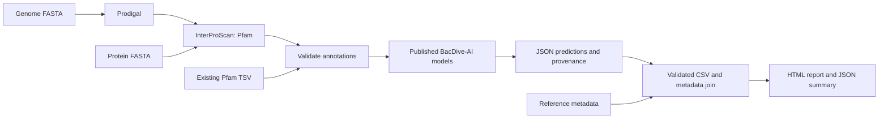

# BacDive-AI workflow

[](https://github.com/mobashirrahman/bacdive-ai-workflow/actions/workflows/ci.yml)
[](LICENSE)

**An automated, reproducible workflow for predicting eight bacterial traits
from genomes, proteins, or existing Pfam annotations using published BacDive-AI models.**

Developed by **Md Mobashir Rahman**. The project contribution is workflow
engineering: validated inputs, scientific-tool integration, reliable inference,
metadata joins, provenance, batch processing, and reproducible reports. The
pretrained models and underlying method are by Koblitz and colleagues.

## Results and outcomes

The included case study reconstructs an existing **120-genome run**:

| Outcome | Result |
| --- | --- |
| Complete predictions | 120 genomes × 8 traits |
| Reference metadata joined | 79 records, corrected from zero |
| Trait predictions reproduced from models | 960/960, no class changes |

Reference-label comparisons are reported in [docs/RESULTS.md](docs/RESULTS.md)
rather than here, because they are descriptive agreement with supplied curated
labels rather than an accuracy benchmark. Read that page together with
[provenance](docs/PROVENANCE.md) before citing any agreement figure.

- [Full results CSV](docs/results/predictions.csv)
- [JSON summary and disagreements](docs/results/summary.json)
- [Interactive report](docs/results/report.html) — download and open locally
- [Validation record](docs/VALIDATION.md)

## Scope

The workflow predicts acidophily, Gram positivity, spore formation, aerobic and
anaerobic lifestyles, thermophily, psychrophily, and flagellated motility.

It uses **BacDive-AI v1.1**, binary Pfam presence/absence features, and the
upstream default E-value threshold of `1e-20`. No new models are trained. A
prediction is an estimate from a protein-family inventory, not an experimentally
measured phenotype. The probability assigned to a predicted label is not measured
accuracy. Assembly quality and annotation/database differences affect the
available input features.

## Workflow



The three input types converge on the same inference and reporting stages.
Snakemake tracks model, annotation, metadata, and source dependencies. Failed or
incomplete predictions fail the workflow instead of appearing as successful results.

## Quick start: real annotation example

Use **Python 3.12**. The prediction environment pins scikit-learn 1.4.0 to match
the supplied models. Allow approximately 750 MB for extracted models.

```bash
git clone https://github.com/mobashirrahman/bacdive-ai-workflow.git
cd bacdive-ai-workflow
python3.12 -m venv .venv
source .venv/bin/activate
python -m pip install -e '.[dev,workflow]'
python -m bacdive_workflow.models --archive Archiv.zip --model-dir models
snakemake --cores 2
python scripts/check_example.py results/predictions/1120941.3.json
```

This runs inference on the upstream *Actinomyces dentalis* DSM 19115 annotation
example. It does not need Prodigal, Java, or an InterProScan database because the
Pfam annotation is included. Outputs:

```text
results/predictions/1120941.3.json
results/bacdive_ai_predictions.csv
results/summary.json
results/report.html
```

Open `results/report.html` in a browser. It works offline and includes a
searchable sample table, trait distributions, reference comparisons, and genome
quality fields when supplied.

## Run your data

Create a CSV or TSV sample sheet with a unique `sample_id` and **exactly one**
input path per row:

```text
sample_id	genome_path	protein_path	annotation_path	taxon
assembly_A	genomes/A.fna			Example species
proteome_B		proteins/B.faa		Example species
annotated_C			annotations/C.tsv	Example species
```

The gaps represent empty tab-separated fields. **Input paths are relative to
the sample sheet**, so a sheet at `config/samples.tsv` can use `../genomes/A.fna`.
Optional fields include `taxon`, `gram_stain`, `oxygen_tolerance`, `completeness`,
`contamination`, and `data_source`. A separate reference table uses the same
`sample_id`; legacy `genome_address`, `gram stain`, and `oxygen tolerance`
columns are accepted for migration.

Copy and edit `config/config.yaml`, then run:

```bash
snakemake --configfile config/my-config.yaml --cores 8 --dry-run
snakemake --configfile config/my-config.yaml --cores 8 --sdm conda
```

Genome inputs require Prodigal 2.6.3; its environment is provided. Genome and
protein inputs require a configured InterProScan installation and Pfam data.
Set `interproscan` to the executable path. The historical case study used
InterProScan **5.74-105.0 / Pfam 37.3**. Record the release you use; newer
annotations may change feature inventories and predictions. InterProScan data
installation is external to this repository.

Use `--set-threads interproscan=8` and Snakemake resource options to tune a run.
`profiles/local` contains example local execution settings. Use `--directory`
for a separate execution directory and supply config/model paths appropriate
to that directory. The default configuration assumes execution from the repo root.

## Prediction and batch commands

The original positional command remains available:

```bash
python predict.py gram-positive examples/1120941.3.faa.tsv
python predict.py all examples/1120941.3.faa.tsv --text-output
bacdive-predict all examples/1120941.3.faa.tsv --output example.json
bacdive-predict all examples/1120941.3.faa.tsv --traits gram-positive anaerobic
```

JSON is the default. It records both `confidence` (the probability of the
predicted label, in percent) and `positive_probability` (the probability of the
positive class, from 0 to 1), plus annotation/model checksums, dependency
versions, feature encoding, and parsing counts. Use `--model-dir`, `--sample-id`,
`--log-file`, and `--debug` when needed. Logs go to stderr; JSON goes to stdout
or an atomically written file.

For many existing annotations, batch inference loads the verified models once:

```bash
bacdive-batch --samples examples/samples.tsv --output-dir results/batch
bacdive-aggregate results/batch/*.json --samples examples/samples.tsv \
  --metadata examples/metadata.tsv --output results/batch.csv
bacdive-report results/batch.csv --html results/batch.html --summary results/batch-summary.json
```

Batch inference accepts annotation inputs only. Snakemake supports all three
input types and execution/resumption per sample. The cached batch path uses
more memory because it retains all selected models.

## Reproduce the published case study

```bash
python scripts/reproduce_case_study.py
python scripts/reproduce_case_study.py --check
```

The portable snapshot includes 120 saved prediction files, a reduced sample
table, and 79 reference records. Reproduction rebuilds the published CSV, HTML,
and JSON exactly. It does not require the original server's genome paths or
rerun annotation. [Provenance](docs/PROVENANCE.md) distinguishes saved artifacts
from fresh inference and records known data limitations.

## Development and checks

```bash
ruff check bacdive_workflow tests scripts predict.py
ruff format --check bacdive_workflow tests scripts predict.py
pytest -q
python scripts/reproduce_case_study.py --check
```

CI runs regression checks, the actual upstream model example through Snakemake,
and exact artifact reproduction. See [CONTRIBUTING.md](CONTRIBUTING.md), the
[changelog](CHANGELOG.md), and [validation record](docs/VALIDATION.md).

## Attribution and citation

This repository retains the original BacDive-AI history and model archive.
Models and the example annotation originate from
[BacDive-AI v1.1](https://doi.org/10.5281/zenodo.13757323), by Julia Koblitz and
Lorenz Christian Reimer. Workflow additions began in May 2025; the current
release adds validation, packaging, reproducible results, and reporting.

When using the method, cite **Koblitz, Reimer, Pukall & Overmann (2025)**,
*Predicting bacterial phenotypic traits through improved machine learning using
high-quality, curated datasets*, Communications Biology 8, 897.
[DOI: 10.1038/s42003-025-08313-3](https://doi.org/10.1038/s42003-025-08313-3).

The workflow and supplied model release use **GPL-3.0-or-later**. See
[LICENSE](LICENSE), [CITATION.cff](CITATION.cff), and [PROVENANCE.md](docs/PROVENANCE.md).
