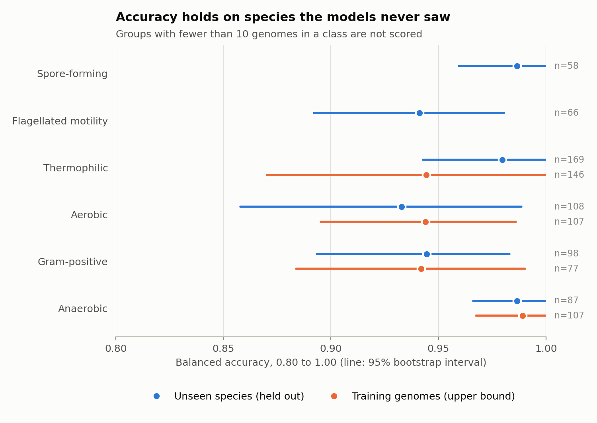
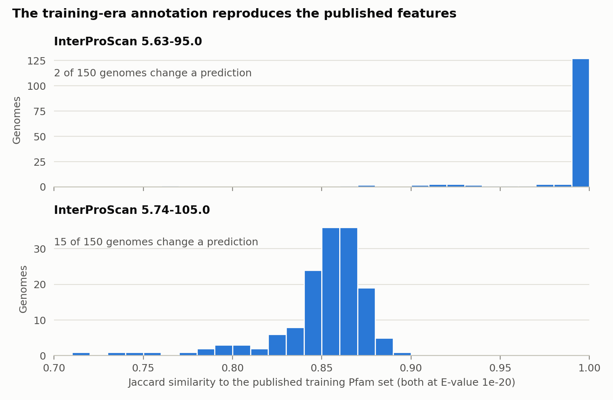
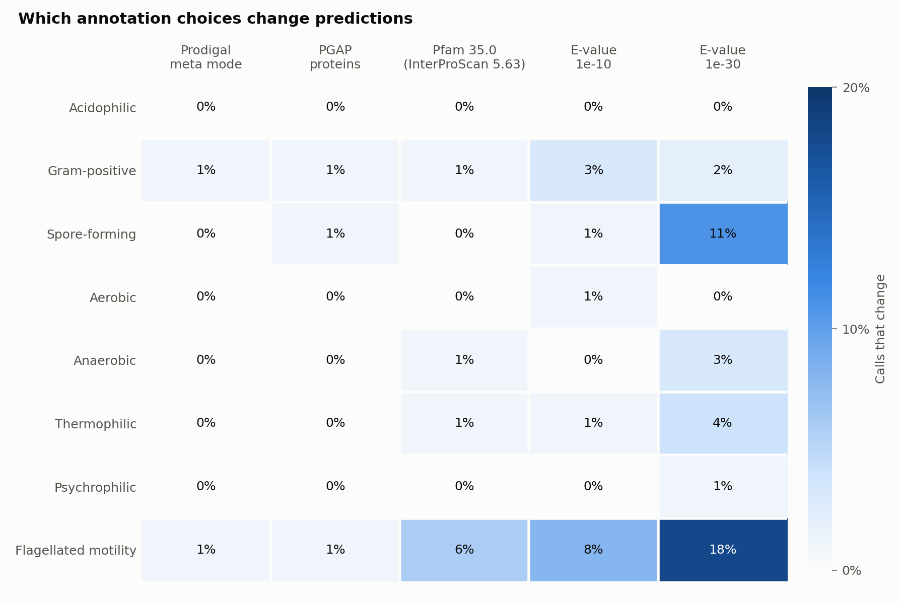

# Benchmark: how far can BacDive-AI predictions be trusted?

## Question

> How far can BacDive-AI predictions be trusted on genomes the models never
> saw, on incomplete genomes, and under a different annotation route?

The models were trained on complete-ish isolate genomes annotated with
InterProScan and evaluated with random 5-fold cross-validation only. Downstream
use (e.g. metaTraits on 1.1 million MAGs at >50% completeness with
eggNOG-mapper Pfam annotation) leaves that evaluation behind in three ways.
This benchmark measures each one separately with a reproducible Snakemake
workflow (`benchmark/`). Tables below are generated from
`docs/benchmark/*.tsv` by `scripts/build_benchmark_tables.py` and are never
typed by hand.

## Design

- **A. Leakage-controlled accuracy.** 150 seen genomes (training strains, an
  upper bound — training-set performance, not accuracy) against 174 unseen
  genomes with no strain, genome, or species overlap with training, plus a
  32-genome genus-unseen subset. Reference labels come from calibrated BacDive
  mappings, never from BacDive-AI outputs.
- **B. Annotation drift.** Seen-set Pfam sets from our annotation (two
  InterProScan versions) versus the published training feature sets, at the
  same E-value threshold.
- **C. Completeness degradation.** Seeded fragment loss (8 levels, 10
  replicates, contamination at 100% and 70%), with a real re-annotation
  shortcut validation on 20 genomes.
- **D. Annotation robustness.** E-value thresholds, gene caller (Prodigal
  single/meta, PGAP), and Pfam release on a 100-genome subset.

Primary configuration everywhere: InterProScan 5.74-105.0 / Pfam 37.3,
Prodigal single, E-value 1e-20. Full run wall time was about 15 hours on
16 cores with at most 4 concurrent InterProScan jobs.

## Genome selection and leakage control

12,412 training strain IDs and 24,426 candidate records were harvested from
the BacDive API (100-ID batches, cached raw JSON, harvest 2026-10-04). Seen
genomes are training strains with a GCA/GCF accession and published feature
rows. Unseen genomes share no BacDive ID, no accession (INSDC or BV-BRC), and
no species name with training; 32 additionally share no genus. Assemblies are
Complete Genome or Chromosome (17 recorded ≤50-contig top-ups supply rare
positives). Sampling is seeded (20261004), proportional by phylum with a
floor of 3, one genome per species, across 38 phyla; 307 of 324 genomes are
type strains. Frozen in `benchmark/config/genomes.tsv`; exclusion sets in
`benchmark/config/training_lookup.json`, enforced by `tests/test_selection.py`.

## Label calibration and the gate

BacDive field values were cross-tabulated against the 44,747 published
training labels; a value maps to a class only at ≥95% purity over ≥30
strains, and conflicting votes exclude the strain. The mapping reproduces
98.3–99.9% of training labels over thousands of strains per trait, so all
six traits (gram-positive, motile2+, anaerobic, aerobic, thermophile,
spore-forming) enter accuracy analysis. Acidophile and psychrophile have no
training rows and are stability-only. Full cross-tabs in
`docs/benchmark/label_mapping_calibration.csv`.

## A. Leakage-controlled accuracy

Seen numbers are training-set performance (upper bound), not accuracy.

<!-- benchmark:accuracy -->
| Trait | Set | n | Pos | Neg | Sens | Spec | Bal.acc [95% CI] | MCC | AUROC |
| --- | --- | ---: | ---: | ---: | ---: | ---: | ---: | ---: | ---: |
| aerobic | seen | 107 | 36 | 71 | 0.944 | 0.944 | 0.944 [0.895, 0.986] | 0.877 | 0.984 |
| aerobic | unseen | 108 | 20 | 88 | 0.900 | 0.966 | 0.933 [0.858, 0.989] | 0.850 | 0.991 |
| aerobic | genus_unseen | 22 | 1 | 21 | — | — | — — | — | — |
| anaerobic | seen | 107 | 46 | 61 | 0.978 | 1.000 | 0.989 [0.967, 1.000] | 0.981 | 1.000 |
| anaerobic | unseen | 87 | 13 | 74 | 1.000 | 0.973 | 0.986 [0.966, 1.000] | 0.918 | 1.000 |
| anaerobic | genus_unseen | 13 | 3 | 10 | — | — | — — | — | — |
| gram-positive | seen | 77 | 26 | 51 | 0.923 | 0.961 | 0.942 [0.884, 0.990] | 0.884 | 0.981 |
| gram-positive | unseen | 98 | 39 | 59 | 0.923 | 0.966 | 0.945 [0.894, 0.983] | 0.893 | 0.984 |
| gram-positive | genus_unseen | 14 | 4 | 10 | — | — | — — | — | — |
| motile2+ | seen | 46 | 5 | 41 | — | — | — — | — | — |
| motile2+ | unseen | 66 | 15 | 51 | 1.000 | 0.882 | 0.941 [0.892, 0.980] | 0.794 | 0.995 |
| motile2+ | genus_unseen | 9 | 2 | 7 | — | — | — — | — | — |
| spore-forming | seen | 28 | 3 | 25 | — | — | — — | — | — |
| spore-forming | unseen | 58 | 21 | 37 | 1.000 | 0.973 | 0.986 [0.959, 1.000] | 0.964 | 1.000 |
| spore-forming | genus_unseen | 8 | 0 | 8 | — | — | — — | — | — |
| thermophile | seen | 146 | 27 | 119 | 0.889 | 1.000 | 0.944 [0.870, 1.000] | 0.931 | 0.999 |
| thermophile | unseen | 169 | 30 | 139 | 0.967 | 0.993 | 0.980 [0.943, 1.000] | 0.959 | 1.000 |
| thermophile | genus_unseen | 31 | 9 | 22 | — | — | — — | — | — |
<!-- /benchmark:accuracy -->



Unseen accuracy matches seen accuracy within bootstrap intervals on every
eligible trait, so there is no drop at the species level. Most unseen
genomes still belong to a genus present in training; the genus-unseen groups
are too small to score, so generalisation to new genera is not established. The 35 disagreements
(`docs/benchmark/disagreements.tsv`: 11 aerobic, 9 gram-positive, 6
motile2+, 5 thermophile, 3 anaerobic, 1 spore-forming) are listed with
genome, taxon, label, and probability for follow-up. Genus-unseen groups
(9–31 genomes, fewer than 10 per class) report counts only, by design.

## C. Completeness degradation

A degraded prediction can only flip if there is something to lose, so the
table conditions on the full-genome call. "Lost" is the share of genomes
predicted positive on the full genome that are called negative at that
completeness (unseen set, no contamination, 10 replicates per genome). The
last column is the opposite error among full-genome negatives.

<!-- benchmark:flip -->
| Trait | Positive genomes | Lost at 90% | Lost at 70% | Lost at 50% | Lost at 30% | Negatives turned positive at 50% |
| --- | ---: | ---: | ---: | ---: | ---: | ---: |
| acidophile | 1 of 174 | 0.30 | 1.00 | 1.00 | 1.00 | 0.000 |
| aerobic | 72 of 174 | 0.02 | 0.06 | 0.18 | 0.53 | 0.004 |
| anaerobic | 84 of 174 | 0.00 | 0.01 | 0.04 | 0.28 | 0.002 |
| gram-positive | 52 of 174 | 0.01 | 0.03 | 0.07 | 0.23 | 0.020 |
| motile2+ | 70 of 174 | 0.15 | 0.48 | 0.84 | 0.98 | 0.000 |
| psychrophile | 0 of 174 | — | — | — | — | 0.000 |
| spore-forming | 36 of 174 | 0.19 | 0.68 | 0.97 | 1.00 | 0.000 |
| thermophile | 32 of 174 | 0.03 | 0.21 | 0.63 | 0.95 | 0.000 |
<!-- /benchmark:flip -->


The error is one-directional. Negatives almost never turn positive, so a
positive call on an incomplete genome is as reliable as on a complete one,
while a negative call is weak evidence for the gene-rich traits: at 50%
completeness nearly all predicted spore-formers, most motile genomes and
about two thirds of thermophiles are called negative. Gram stain and oxygen
preference hold up far better. Averaged over all genomes these losses look
small, because most genomes are negative for these traits and cannot flip;
`docs/benchmark/degrade_summary.tsv` reports both views (`flip_rate` over all
draws, `positive_loss_rate` over full-genome positives).

Lowest tested completeness (10-point steps) at which more than 95% of
positive calls survive, both sets pooled, with a bootstrap interval over
positive genomes. 100% means that even the 90% level loses more than 5%. The
last column is the same threshold on the all-genome flip rate.

<!-- benchmark:thresholds -->
| Trait | Positive genomes | Lowest completeness keeping >95% of positives | Bootstrap interval | Lowest completeness, all-genome flip rate <5% |
| --- | ---: | ---: | ---: | ---: |
| acidophile | 2 of 324 | — | — | 30% |
| aerobic | 136 of 324 | 80% | [70%, 90%] | 60% |
| anaerobic | 136 of 324 | 60% | [50%, 70%] | 50% |
| gram-positive | 91 of 324 | 70% | [50%, 100%] | 40% |
| motile2+ | 112 of 324 | 100% | [100%, 100%] | 100% |
| psychrophile | 2 of 324 | — | — | 30% |
| spore-forming | 46 of 324 | 100% | [100%, 100%] | 90% |
| thermophile | 56 of 324 | 100% | [100%, 100%] | 80% |
<!-- /benchmark:thresholds -->

Acidophile and psychrophile cannot be assessed: the models call almost no
genome positive for either (see the positive counts), so their near-zero
all-genome flip rates say nothing about robustness.

Contamination at 5–10% foreign bases changes little compared with
completeness. At 70% completeness the loss of positive calls stays within a
few points for motility, spore formation and oxygen preference; Gram-positive
is the exception, where 10% contamination raises the loss from 3% to 10%.

The simulation drops genes by position instead of re-annotating fragments.
Checked against real Prodigal and InterProScan runs on the same fragments
(20 genomes, two levels), it gives the same class in 318 of 320 comparisons
with a mean probability difference of 0.008.

## B. Annotation drift against the published features

The published features file has an undocumented schema. Its fourth column
behaves as a best E-value per Pfam
(`docs/benchmark/features_file_characterization.md`), and the file is not
filtered at the 1e-20 threshold the predictor applies. Drift is therefore
measured with the same 1e-20 threshold on both sides. The two right-hand
columns compare against the published sets as shipped; they mix annotation
drift with the threshold difference and are shown only for reference.

<!-- benchmark:drift -->
| InterProScan | Genomes | Median Jaccard | Min | Genomes with a changed prediction | Median Jaccard, published unfiltered | Changed, published unfiltered |
| --- | ---: | ---: | ---: | ---: | ---: | ---: |
| 5.63-95.0 | 150 | 1.000 | 0.769 | 2 | 0.686 | 26 |
| 5.74-105.0 | 150 | 0.857 | 0.716 | 15 | 0.604 | 34 |
<!-- /benchmark:drift -->



With the training-era InterProScan 5.63-95.0 (Pfam 35.0) our pipeline
reproduces the published Pfam sets almost exactly, and only 2 of 150 genomes
change any prediction. That supports reading the fourth column as an E-value
and shows the gene-calling and annotation route here matches the authors'.
With InterProScan 5.74-105.0 (Pfam 37.3) similarity drops to a median of
0.86 and 15 of 150 genomes change at least one prediction. The drift is the
Pfam release, not the pipeline: models trained on Pfam 35.0 features are
being applied to Pfam 37.3 annotations.

## D. Annotation robustness

Class agreement with the primary configuration on 100 genomes (93 with PGAP
proteins), plus mean absolute probability difference and accuracy on the
labelled subset:

<!-- benchmark:robustness -->
| Trait | Caller meta | Caller PGAP | Pfam 5.63 | E-value 1e-10 | E-value 1e-30 |
| --- | ---: | ---: | ---: | ---: | ---: |
| acidophile | 1.000 | 1.000 | 1.000 | 1.000 | 1.000 |
| aerobic | 1.000 | 1.000 | 1.000 | 0.990 | 1.000 |
| anaerobic | 1.000 | 1.000 | 0.990 | 1.000 | 0.970 |
| gram-positive | 0.990 | 0.989 | 0.990 | 0.970 | 0.980 |
| motile2+ | 0.990 | 0.989 | 0.940 | 0.920 | 0.820 |
| psychrophile | 1.000 | 1.000 | 1.000 | 1.000 | 0.990 |
| spore-forming | 1.000 | 0.989 | 1.000 | 0.990 | 0.890 |
| thermophile | 1.000 | 1.000 | 0.990 | 0.990 | 0.960 |
<!-- /benchmark:robustness -->



Gene caller barely moves classes. Pfam release agrees on at least 0.99 of
calls for every trait except motility (0.94), consistent with the drift
analysis. E-value thresholds matter most for motility (0.82 agreement at
1e-30) and spore formation (0.89), the same two traits that are most
sensitive to completeness.

## Limitations

- Unseen-set labels come from BacDive, the same curation source as training.
  The test controls for strain, genome, and species leakage, not for shared
  curation practice.
- Simulated completeness is fraction of bases retained, not a CheckM
  estimate, and random fragment loss is kinder than real binning, which loses
  genomic islands and plasmids preferentially.
- Acidophile, psychrophile, and any gate-failing trait have stability results
  only. Seen-set numbers are training-set performance.
- The published features file has an undocumented schema. Drift results
  assume its fourth column is an E-value; the near-exact match under
  InterProScan 5.63-95.0 supports that but the authors have not confirmed it.
- Degradation results are relative to the full-genome prediction, not to
  measured phenotypes, and come from simulated fragment loss. Real MAGs were
  not tested.

## Reproduce

```bash
snakemake -s benchmark/Snakefile --directory <data_root>/run \
  --workflow-profile benchmark/profiles/local --sdm conda --cores 16 \
  --resources ips=4
python scripts/build_benchmark_tables.py --check
```

`benchmark/.test/` runs the predict, degrade, metrics, and report rules
offline in minutes with the real models. Per-table SHA-256 records are in
`docs/benchmark/MANIFEST.tsv`; the workflow graph is
`docs/benchmark/rulegraph.svg`.
